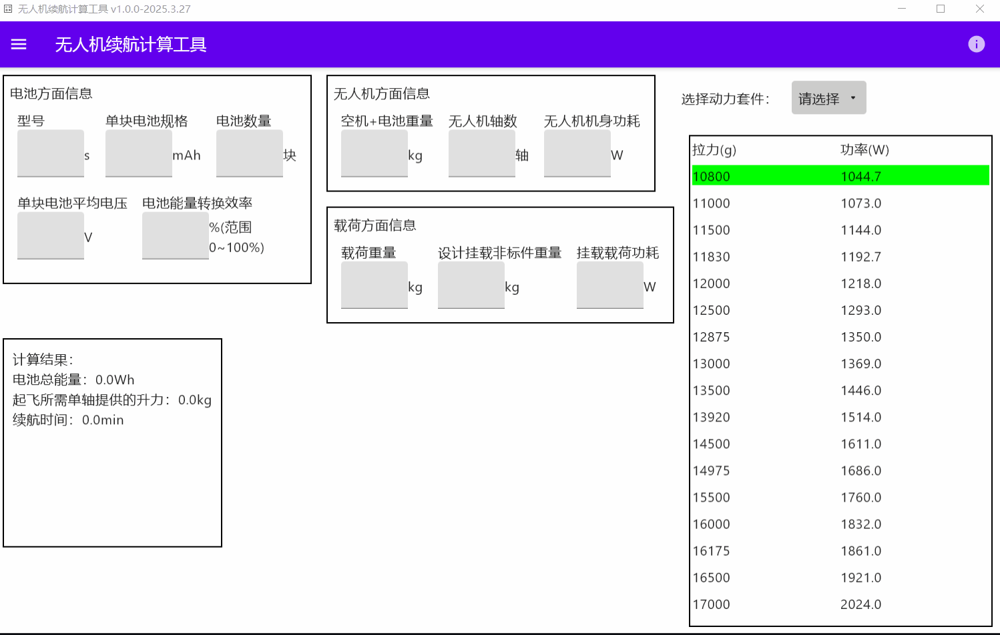

工具使用步骤：
1. 在主页左上角，呼出抽屉菜单，点击“添加菜单项”，即为增加不同类型动力套的参数值。比如你有多个动力套种类，在此可添加多个菜单项即可。
2. 创建完动力套菜单项后，点击新建的菜单项，会看到动力套对应的配置，分为“拉力”和“功率”两列，将动力套厂家提供的数据，逐一输入进去，最后“保存数据”即可。期间可对数据进行“增加数据”和“删除数据”的操作，操作完后程序会自动根据拉力值排序呈现。
3. 菜单项可自行删除动力套来管理
4. 此时可进行续航计算了。在主界面按照文字提示，输入要计算的相关输入内容，最后在右侧“选择动力套件”的下拉框内，选择你要匹配的动力套即可，下方列表会自动计算参数和动力套匹配的拉力和功率，用绿色标记出，并且在“计算结果”区域，可动态展示结果数据。

截图：

